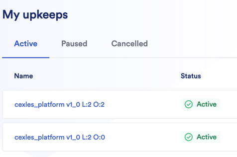

# Automation-lb
### Chainlink Automation scaling &amp; loadbalancing 



## Motivation
_Nobody likes out-of-gas._

In [Cexles](https://cexles.finance) we need to scale [Chainlink Automation](https://chain.link/automation) to perform a huge number of on-chain operations in a single block and distribute their execution between multiple Chainlink Nodes without manual user intervention. 
This software will allow us to unlock the full potential of Chainlink Automation. 

## Current stage
We started an initial development of MVP with smart contracts deployed on Goerli Ethereum testnet.
MVP PoC version. Needs refactor & minor bug fixing.

## Desired result
Hassle-free automated scaling for any Chainlink Automation compatible contract. 

## TODO
- [x] Initial research
- [x] Initial project skeleton
- [x] Sample test smart contract
- [ ] Multiple contracts support
- [x] Automated upkeeps creating
- [ ] Upkeeps load metrics
- [x] Automated on-condition upkeeps scaling
- [ ] Upkeeps scailing prediction
- [x] Automated Upkeep's balance top-up
- [ ] API
- [ ] Dashboard
- [ ] Tests
- [ ] Reference contract implementation
- [x] [Public Docs](https://docs.cexles.finance)

## Installing
- Install Docker and Docker Compose
- Copy config file
  ```shell 
  cp goerli.example.config.yaml config.yaml
    ```
- Set config values according to docs
- Run build
  ```shell
  docker-compose build
  ```
- Run balancer
  ```shell
  docker-compose up -d
  ```
- Check program logs. If everything is fine you will see something similar to:
  ```shell
  INF upkeep controller found address=0x3911d7499d72dd5f4ea88270af6dfeced1a1bef6
  INF logic contract found name="Cexles platform contract" short_name=cexles_platform version=1_0
  INF subscribed to NewHead event func=StartBlockListener module=service.ChainService
  ```
  
    <i>If you have any questions about installing/usage feel free to create an issue</i>

### <i>Let Chainlink grow with your web3 infrastructure</i>
